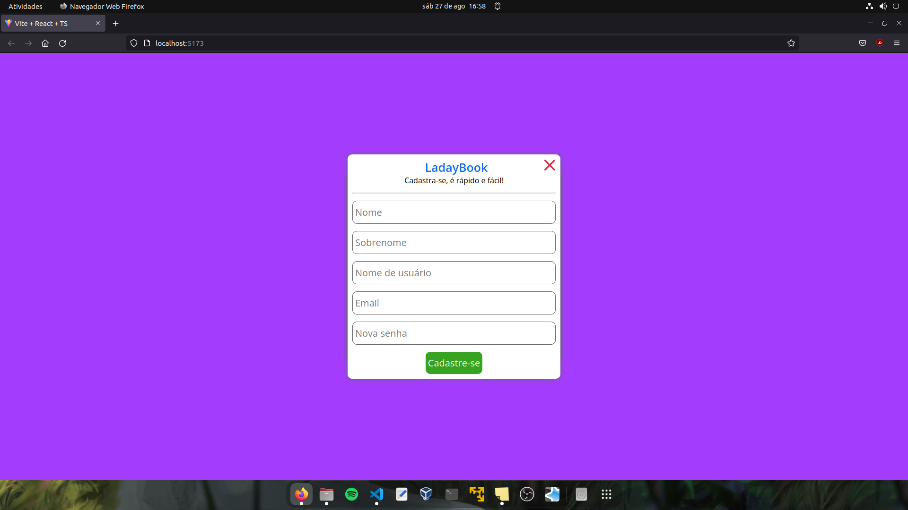

# LadayBook

Este projeto foi feito com React + TypeScript e simula uma mini rede social onde você pode está criando uma conta e fazendo login para fazer suas publicações. O principal objetivo foi por em prática meus novos conhecimentos em Redux com React-Router. O projeto possui algumas ações como:
- Criar um usuário
- Fazer Login
- Adicionar uma nova publicação
- Remover publicação

Nesse projeto foi feito o uso das bibliotecas:
- [uuid](https://www.npmjs.com/package/uuid)
- [react-router-dom](https://www.npmjs.com/package/react-router-dom)
- [redux](https://redux.js.org/)
- [react-redux](https://react-redux.js.org/)
- [@reduxjs/toolkit](https://redux-toolkit.js.org/)

## Estilização
Para estilização foi usada a biblioteca [Styled-Components](https://styled-components.com/).

## Projeto gerado em VITE

### Instalação
- `npm install`

### Para rodar
- `npm run dev`

## Para testar
O projeto foi hospedado na Vercel. Para testes: [Clique aqui](https://react-create-redux.vercel.app/).

## Como usar
- Crie uma conta

- Faça Login

- Faça suas publicações

